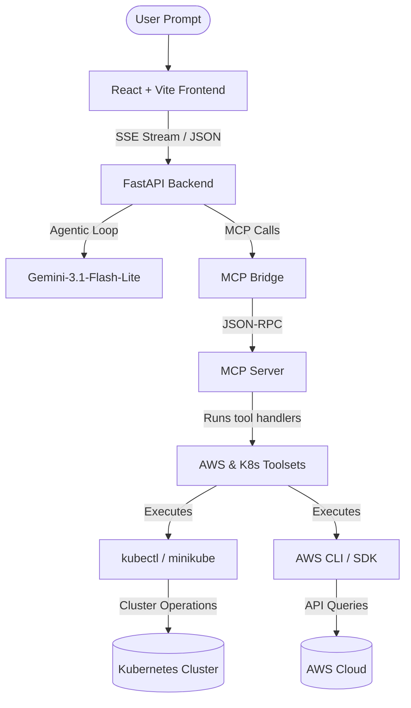

# 🚀 DevOps Autopilot

**DevOps Autopilot** is an AI-native agentic dashboard and Model Context Protocol (MCP) server that allows you to manage, monitor, and troubleshoot your Kubernetes clusters and AWS infrastructure using natural language. 

By combining Anthropic's Model Context Protocol (MCP), Google's Gemini LLM, and a modern React web interface, DevOps Autopilot acts as a universal adapter between your natural language prompts and your cloud architecture.

---

## 📸 Overview

When a service breaks in production, DevOps teams usually SSH into clusters, run diagnostic commands manually, and parse logs line-by-line. **DevOps Autopilot** changes this:

```
User: "What's broken in my default namespace? Describe any crashed pods and check recent events."
DevOps Autopilot:
  ↳ 🔍 Calls `get_events()` to search for warnings...
  ↳ 📦 Calls `get_pods()` to identify CrashLoopBackOffs...
  ↳ 📄 Calls `get_pod_logs(pod="payment-api-xxx")` to read stdout/stderr...
  ↳ 💡 Suggests and applies the fix!
```

---

## ✨ Features

### ☸️ Kubernetes Management
*   **Cluster Diagnostics**: Instantly check pods, deployments, services, events, and nodes (`kubectl`).
*   **Active Controls**: Restart deployments (rollout restart), scale replicas, and delete stuck pods.
*   **YAML Manifests**: Generate, validate (dry-run by default), and apply Kubernetes configurations.
*   **Built-in Safety Guardrails**: Prevent model-driven deletions or alterations in critical namespaces (such as `kube-system`).

### ☁️ AWS Cloud Auditing
*   **Compute & Serverless**: List EC2 instances (type, state, IPs) and Lambda functions.
*   **Security Auditing**: Identify security groups with open inbound configurations (`0.0.0.0/0`) and scan for IAM roles holding `AdministratorAccess`.
*   **Log Inspection**: Stream recent CloudWatch logs directly into the prompt context.
*   **Cost Management**: Retrieve blended cost breakdowns by service for any date range.
*   **S3 Auditing**: Scan S3 buckets and identify public visibility risk.

### 💻 User Interface & Streaming Agent
*   **Kubernetes Monitoring Dashboard**: A modern, interactive dashboard showing real-time resource statistics.
*   **SSE Chat Streaming**: Server-Sent Events (SSE) provide immediate streaming responses from the LLM, showing the exact tool calls being executed as they happen.
*   **Agentic Orchestration Loop**: The backend executes multi-step tool calls autonomously, feeding results back to Gemini until a resolution is reached.

---

## 🏗️ Architecture



---

## 🛠️ Technology Stack

*   **Frontend**: React (JS), Vite, TailwindCSS (for responsive UI styling), Server-Sent Events (SSE) listener.
*   **Backend**: FastAPI (Python), Google GenAI SDK (orchestrating `gemini-3.1-flash-lite`), Uvicorn.
*   **Model Context Protocol**: Anthropic's Python `mcp` SDK running tool declarations in `mcp-server/`.
*   **Deployment**: Multi-container Docker Compose.

---

## 🚀 Quick Start (Local Setup)

### Prerequisites
*   [Docker](https://docs.docker.com/get-docker/) & [Docker Compose](https://docs.docker.com/compose/install/)
*   An active Kubernetes context (e.g., [Minikube](https://minikube.sigs.k8s.io/docs/start/) or a configured `kubeconfig` file)
*   AWS credentials configured on the host machine (`aws configure`)
*   A Gemini API Key (obtain from Google AI Studio)

### Step 1: Set Environment Variables
Create a `.env` file inside the `backend` directory:
```bash
cp backend/.env.example backend/.env # or write directly
```
Add your credentials:
```env
GEMINI_API_KEY=your_gemini_api_key
AWS_PROFILE=default
AWS_REGION=us-east-1
```

### Step 2: Spin Up with Docker Compose
Run the following command from the root directory to build and start the backend and frontend:
```bash
docker compose up --build -d
```
The Docker Compose file automatically mounts your local host configuration folders (`~/.kube` and `~/.aws`) to the containers so that they can communicate with your cluster and cloud resources.

### Step 3: Access the UI
Open your browser and navigate to:
```
http://localhost:8080
```

---

## 📝 Example Queries to Try

Here are some natural language prompts you can write to the DevOps Autopilot:

*   *"Show me all running pods in the default namespace."*
*   *"Scale the backend deployment to 3 replicas."*
*   *"Audit my security groups in us-east-1 for open incoming traffic."*
*   *"Get the last 20 lines of logs for the payment pod."*
*   *"Break down AWS service costs from the last month."*
*   *"Show the status of my EC2 instances in us-east-1."*

---

## 🔒 Security & Guardrails

*   **Dry Runs**: Commands modifying Kubernetes resources (like applying YAML manifests) trigger `--dry-run=client` by default. You must explicitly tell the agent "go ahead and apply it" or "yes do it" to skip dry run mode.
*   **Namespace Shield**: Tool definitions block destructive operations on system resources. For example, deleting pods inside the `kube-system` namespace returns a safety error immediately without executing.
